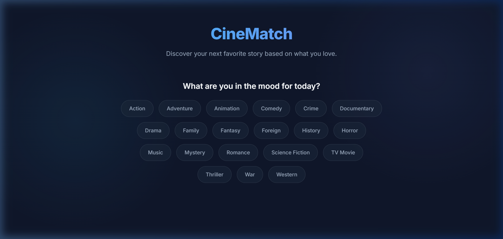
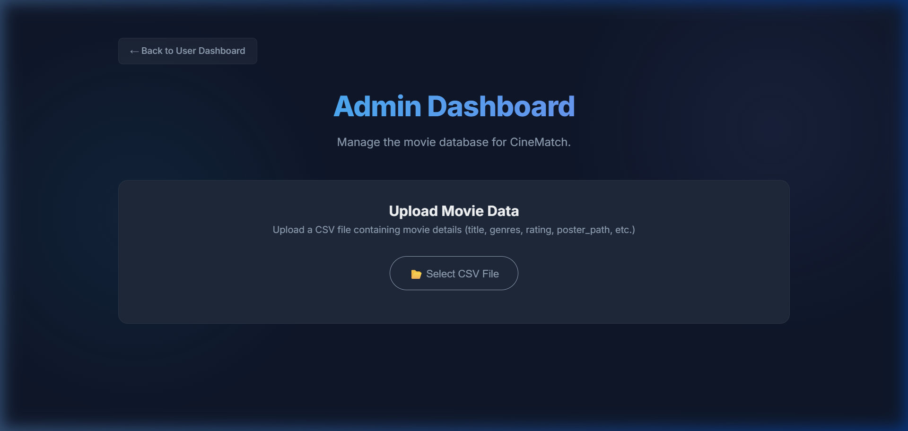

# CineMatch 🎬 | Modern Movie Recommender

CineMatch is a sleek, responsive, and performance-oriented web application designed to help users find their next favorite movie. Built with a premium dark-themed UI, CineMatch allows users to select genres based on their current mood and instantly receives rated movie recommendations. 

Additionally, the project includes a robust **Admin Dashboard** allowing custom dataset uploads (CSVs), and a suite of server-side data conversion scripts (Node.js, Python, and PowerShell) to process large-scale TMDB datasets.

---

## 📸 Screenshots

### User Homepage


### Admin Dashboard


---

## ✨ Features

- 🎭 **Dynamic Mood/Genre Filtering**: Toggle multiple genres to find perfect matches based on what you are in the mood for.
- ⭐ **Rating-Prioritized Recommendations**: Automatically filters and displays recommendations sorted by rating (descending).
- 🚀 **Progressive Loading (Pagination)**: Efficiently displays movies in batches of 50 with a "Load More" option to keep pages loading instantly and smoothly.
- 🎨 **Premium Aesthetics**: Fully responsive layout featuring smooth hover effects, micro-animations, glassmorphism UI elements, and a glowing, animated background gradient.
- ⚙️ **Admin Dashboard**:
  - Direct local CSV file upload.
  - Client-side CSV parsing using **PapaParse**.
  - Local database overrides saved to `localStorage` (supporting customized, standalone recommendation builds).
  - One-click dataset clearing to revert to default database.
- 🗃️ **Multi-Language Preprocessing Pipelines**: Native utility scripts (`convert_data.py`, `convert_data.js`, `convert_data.ps1`) to parse large raw CSV movie files (such as Kaggle TMDB movie datasets) and compile them into static, high-speed Javascript structures.

---

## 🛠️ Tech Stack

- **Frontend**: Vanilla HTML5, CSS3, Modern JavaScript (ES6)
- **CSV Parsing**: PapaParse (Admin panel client-side)
- **Data Conversion/Backend Processing**: Python 3, Node.js, PowerShell
- **Styling**: Vanilla CSS utilizing modern properties (CSS Variables, Flexbox/Grid, Backdrop-filters, `@keyframes` animations, HSL/RGBA harmonious colors)
- **Typography**: Inter (Google Fonts)

---

## 📁 Project Structure

```text
MOvies_Recommender/
│
├── index.html            # User interface for movie recommendations
├── script.js             # Client-side routing, filtering, sorting, pagination logic
├── style.css             # Main stylesheet (premium styling & layouts)
│
├── admin.html            # Administration panel for uploading custom CSVs
├── admin.js              # Handles PapaParse uploads and localStorage logic
│
├── data.js               # Static compiled movie database (default data source)
│
├── convert_data.py       # Python script to parse TMDB metadata CSVs to JS format
├── convert_data.js       # Node.js script to parse TMDB metadata CSVs to JS format
├── convert_data.ps1      # PowerShell helper to run JS data conversions
├── test_write.py         # Small helper script for testing write operations
└── README.md             # Project documentation (this file)
```

---

## 🚀 Quick Start

### 1. Run the App Locally
Since CineMatch is a static web application, you do not need to install complex servers.
- Simply open [index.html](file:///c:/Users/chand/Desktop/MOvies_Recommender/index.html) in any modern web browser.
- Select your preferred genres and watch CineMatch recommend movies instantly!

### 2. Access the Admin Dashboard
- Open [admin.html](file:///c:/Users/chand/Desktop/MOvies_Recommender/admin.html) to manage the local database.
- You can upload a standard CSV file (e.g., from Kaggle/TMDB dataset).
- Once processed, it will store the movie entries in your browser's local storage to override default listings on `index.html`.

---

## 📦 Dataset & Preprocessing

If you want to reload or generate a new default dataset `data.js` using raw CSV datasets (such as the standard `movies_metadata.csv` containing columns like `title`, `poster_path`, `genres`, `vote_average`, `release_date`, and `overview`):

### Using Python
Make sure you have Python installed, then verify that the path to `movies_metadata.csv` in `convert_data.py` is correct:
```bash
python convert_data.py
```

### Using Node.js
Ensure Node.js is installed on your computer, check the paths in `convert_data.js`, and run:
```bash
node convert_data.js
```

### Using PowerShell
For Windows users:
```powershell
.\convert_data.ps1
```

Each script parses the source dataset, cleans missing fields, parses JSON-like genre lists, and writes a production-ready `data.js` database containing the top records.

---

## 🎨 Design Theme & Colors

The CineMatch CSS theme relies on modern CSS variables:
- **Background**: Slate dark (`#0f172a` with glowing gradients)
- **Card BG**: Cool slate (`#1e293b`)
- **Primary/Accent**: Sky Blue (`#38bdf8`) & Indigo (`#818cf8`)
- **Success/Rating**: Emerald (`#10b981` / `#34d399`)
